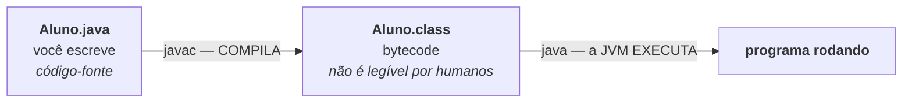

# Aula 01 — Introdução ao Java e à JVM

> 🎯 Objetivos: entender o que é Java e como ele executa, escrever seu primeiro programa e dominar o ciclo **escrever → compilar → executar**.
> 🎬 Slides da aula: [apresentacao-01-introducao-java.pdf](apresentacao/apresentacao-01-introducao-java.pdf)

## 1. O que é Java?

Java é uma linguagem de programação criada em 1995 na Sun Microsystems (hoje Oracle), com uma promessa que virou slogan: **"escreva uma vez, execute em qualquer lugar"**. Trinta anos depois, ela continua entre as linguagens mais usadas do mundo.

Onde o Java roda hoje:

- 🏦 **Back-end corporativo:** bancos, seguradoras, e-commerce, sistemas de governo — grande parte da infraestrutura que você usa todo dia;
- 📱 **Android:** o ecossistema de apps nasceu em Java (hoje divide espaço com Kotlin, que roda na mesma máquina virtual);
- 🧰 **Ferramentas e Big Data:** Elasticsearch, Kafka, Hadoop, IntelliJ — tudo escrito em Java.

Este curso usa Java para ensinar **Programação Orientada a Objetos (POO)** — um jeito de organizar programas em torno de *objetos*, que juntam dados e comportamento. É o modelo dominante no mercado, e o Java é a linguagem que mais o leva a sério: aqui você **não escapa** da POO, e é exatamente por isso que ele ensina tão bem.

> ⚠️ **Java ≠ JavaScript.** Apesar do nome, são linguagens completamente diferentes — a semelhança foi jogada de marketing dos anos 90. Se alguém disser que "Java é a versão do JavaScript para desktop", desconfie de tudo o mais que essa pessoa disser.

## 2. JDK, JVM e o ciclo compilar → executar

Em muitas linguagens você escreve e roda direto. Em Java há um passo no meio:



- **`javac`** (o compilador) traduz seu texto para **bytecode** e, no caminho, **confere se tudo faz sentido**: tipos compatíveis, métodos existentes, ponto e vírgula no lugar. Se algo estiver errado, ele se recusa a gerar o `.class`;
- **JVM** (*Java Virtual Machine*) é quem executa o bytecode. Existe uma JVM para Windows, outra para Linux, outra para Mac — e o **mesmo** `.class` roda nas três. É daí que vem o "escreva uma vez, execute em qualquer lugar";
- **JDK** (*Java Development Kit*) é o pacote que traz o compilador, a JVM e a biblioteca padrão. É o que você instalou no [guia de ambiente](../../recursos/ambiente.md).

> 💡 **Esse compilador é seu melhor amigo.** Ele parece chato no começo (reclama de tudo!), mas cada reclamação é um bug que você **não** vai caçar às duas da manhã. Erro de compilação é barato; erro em produção, não.

## 3. Primeiro programa

Crie a pasta da aula **no seu repositório de exercícios**:

```bash
cd exercicios-java-poo
mkdir aula-01
cd aula-01
```

Crie o arquivo `Ola.java` — atenção ao nome, com **O maiúsculo**:

```java
public class Ola {
    public static void main(String[] args) {
        System.out.println("Olá, mundo!");
    }
}
```

Agora faça o caminho longo, **uma vez na vida**, para ver o ciclo acontecer:

```bash
javac Ola.java     # compila → cria o arquivo Ola.class
ls                 # confira: Ola.java e Ola.class
java Ola           # executa (SEM o .class no fim!)
```

Saída:

```
Olá, mundo!
```

> 💡 **Do dia a dia em diante:** desde o JDK 11, `java Ola.java` compila e executa num passo só. Use isso nos exercícios — mas agora você sabe o que acontece por baixo.

### A anatomia da linha mais assustadora do Java

```java
public class Ola {                              // (1)
    public static void main(String[] args) {    // (2)
        System.out.println("Olá, mundo!");      // (3)
    }
}
```

1. **`public class Ola`** — em Java, *todo* código mora dentro de uma classe. O nome da classe pública **precisa ser idêntico ao nome do arquivo**: `Ola` ⇔ `Ola.java`;
2. **`public static void main(String[] args)`** — o ponto de partida. Quando você roda `java Ola`, a JVM procura exatamente esta assinatura e começa por ela. Cada palavra tem um motivo (`public` = visível de fora, `static` = não precisa de objeto, `void` = não devolve nada, `String[] args` = argumentos da linha de comando) e você vai entender todas até a Aula 06. Por enquanto, decore o formato — no IntelliJ, digite `psvm` + `Tab`;
3. **`System.out.println(...)`** — imprime no terminal e pula linha.

E repare nas **chaves**: `{` abre um bloco, `}` fecha. A classe abre e fecha; o `main` abre e fecha dentro dela. Manter a indentação certa não é frescura — é como você enxerga quem fecha quem.

## 4. Imprimir, comentar e o ponto e vírgula

```java
public class Impressao {
    public static void main(String[] args) {
        System.out.println("Primeira linha");   // imprime e PULA linha
        System.out.print("Sem pular... ");      // imprime e FICA na mesma linha
        System.out.print("continua aqui");
        System.out.println();                   // só pula a linha

        // Comentário de uma linha: o compilador ignora

        /* Comentário
           de várias linhas */

        System.out.println("Fim");
    }
}
```

Saída:

```
Primeira linha
Sem pular... continua aqui
Fim
```

Caracteres especiais dentro do texto usam a **barra invertida**:

```java
System.out.println("Quebra\nde linha");        // \n = nova linha
System.out.println("Coluna1\tColuna2");        // \t = tabulação
System.out.println("Ele disse \"oi\"");        // \" = aspas literal
System.out.println("Barra invertida: \\");     // \\ = uma barra
```

> ⚠️ **O ponto e vírgula não é opcional.** Toda instrução termina com `;`. Esquecer produz `error: ';' expected` — e, cruelmente, o compilador aponta a **linha seguinte**, porque foi só lá que ele percebeu o problema. Ao ver esse erro, olhe **a linha de cima**.

## 5. Lendo os erros do compilador

Erre de propósito. Troque `System.out.println` por `System.out.printn`:

```
Ola.java:3: error: cannot find symbol
        System.out.printn("Olá, mundo!");
                  ^
  symbol:   method printn(String)
  location: variable out of type PrintStream
1 error
```

Leia como um detetive: **arquivo** (`Ola.java`), **linha** (`3`), **tipo** (`cannot find symbol`), **o quê** (`method printn`). O `^` aponta a coluna. Três dos quatro erros mais comuns do curso estão no [guia de erros comuns](../../recursos/erros-comuns.md) — vale abrir agora e dar uma olhada.

> 💡 Na IDE você nem chega a rodar: o sublinhado vermelho aparece enquanto você digita. Passe o mouse por cima para ler a mensagem — é a mesma do compilador.

> 💻 **Código desta aula pronto para rodar:** [`Ola.java`](exemplos/Ola.java) e [`Impressao.java`](exemplos/Impressao.java)

## 🏋️ Exercícios da aula

Na pasta `aula-01/` do seu repositório:

1. **`Ola.java`** — o programa desta aula, compilado com `javac` e executado com `java`. No commit, descreva no *commit message* o que cada um dos dois comandos fez;
2. **`Ficha.java`** — imprima uma ficha sua em 4 linhas (nome, cidade, curso e um objetivo para o curso), usando `println`. Depois reescreva a mesma saída usando **um único** `System.out.println` com `\n`;
3. **`Erros.java`** — provoque **três** erros de compilação diferentes (esqueça um `;`, escreva errado o nome de um método, deixe uma chave sem fechar). Rode `javac` a cada um, **copie a mensagem do compilador num comentário** do arquivo e conserte;
4. **`Corrigir.java`** — crie um arquivo `Corrigir.java` cuja classe se chama `Consertar`. Rode `javac`, leia o erro, e escreva **num comentário** qual é a regra do Java que foi violada. Depois corrija;
5. **Desafio 🌶️ `Arte.java`** — imprima um desenho em ASCII (uma casa, um gato, seu nome em letras grandes) usando `\n`, `\t` e pelo menos um `\"`. Um único `System.out.println` para o desenho inteiro.

### 📤 Entrega

Estes exercícios são feitos em sala e vão para o **seu repositório** `exercicios-java-poo`:

```bash
cd ..                 # da pasta da aula para a raiz do repositório
git add aula-01/
git commit -m "Resolve exercícios da aula 01"
git push
```

Confira no navegador que a pasta apareceu em `github.com/SEU-USUARIO/exercicios-java-poo`.

## 🧠 Revisão

[8 questões de múltipla escolha](revisao/README.md) para conferir se os conceitos ficaram sólidos. Responda sem consultar a aula — depois volte e corrija.

---

➡️ [Aula 02 — Variáveis e Tipos](../aula-02-variaveis-tipos/README.md)
