<!-- _class: capa -->

<div class="emoji">☕</div>

# Introdução ao Java e à JVM

## Aula 01 · Bloco 1 — Fundamentos

<div class="meta">Escrever → compilar → executar</div>

---

## 🎯 Nesta aula

1. O que é Java — e onde ele roda
2. **JDK, JVM** e o ciclo compilar → executar
3. O primeiro programa
4. A anatomia da linha mais assustadora do Java
5. Ler os erros do compilador

---

<!-- _class: lista-limpa -->

## Onde o Java roda hoje

Criado em **1995**, com um slogan que virou lenda: *"escreva uma vez, execute em qualquer lugar"*. Trinta anos depois, segue entre as linguagens mais usadas do mundo.

- 🏦 **Back-end corporativo** — bancos, seguradoras, e-commerce, governo;
- 📱 **Android** — o ecossistema nasceu em Java;
- 🧰 **Ferramentas e Big Data** — Elasticsearch, Kafka, Hadoop, IntelliJ.

---

<!-- _class: lead -->

## ⚠️ Java **não** é JavaScript

Apesar do nome, são linguagens **completamente diferentes**.

A semelhança foi jogada de marketing dos anos 90.

Se alguém disser que *"Java é a versão do JavaScript para desktop"*, desconfie de tudo o mais que essa pessoa disser.

---

## Por que Java para aprender POO

Este curso usa Java para ensinar **Programação Orientada a Objetos** — organizar o programa em torno de *objetos*, que juntam dados e comportamento.

É o modelo dominante no mercado. E o Java é a linguagem que mais o leva a sério:

**aqui você não escapa da POO.**

E é exatamente por isso que ele ensina tão bem.

---

<!-- _class: diagrama -->

## O ciclo: compilar → executar



---

## Os três nomes que você vai ouvir sempre

- **`javac`** — o **compilador**. Traduz seu texto para *bytecode* e, no caminho, **confere se tudo faz sentido**. Se algo estiver errado, ele se recusa a gerar o `.class`;
- **JVM** — *Java Virtual Machine*, quem **executa** o bytecode. Há uma para Windows, outra para Linux, outra para Mac — e o **mesmo** `.class` roda nas três;
- **JDK** — o pacote que traz compilador, JVM e biblioteca padrão.

---

<!-- _class: lead -->

## 💡 O compilador é seu melhor amigo

Ele parece chato no começo — reclama de tudo.

Mas cada reclamação é um bug
que você **não** vai caçar às duas da manhã.

Erro de compilação é barato.
Erro em produção, não.

---

## O primeiro programa

Crie `Ola.java` — atenção ao **O maiúsculo**:

```java
public class Ola {
    public static void main(String[] args) {
        System.out.println("Olá, mundo!");
    }
}
```

Faça o caminho longo, **uma vez na vida**:

```bash
javac Ola.java     # compila → cria Ola.class
java Ola           # executa (SEM o .class no fim!)
```

---

## A linha mais assustadora do Java

```java
public class Ola {                              // (1)
    public static void main(String[] args) {    // (2)
        System.out.println("Olá, mundo!");      // (3)
    }
}
```

1. **`public class Ola`** — *todo* código mora numa classe. O nome **precisa** ser igual ao do arquivo: `Ola` ⇔ `Ola.java`;
2. **`main`** — o ponto de partida. A JVM procura exatamente essa assinatura;
3. **`System.out.println`** — imprime e pula linha.

---

## Sobre o `public static void main`

Cada palavra tem um motivo — e você vai entender todas até a Aula 06:

| Palavra | Quer dizer |
|---|---|
| `public` | visível de fora |
| `static` | não precisa de objeto |
| `void` | não devolve nada |
| `String[] args` | argumentos da linha de comando |

> 💡 Por enquanto, decore o formato. No IntelliJ: digite `psvm` + `Tab`.

---

## Imprimir, comentar, e o ponto e vírgula

```java
System.out.println("Pula linha depois");
System.out.print("Fica na mesma linha... ");
// comentário de uma linha    /* ou de várias */
System.out.println("Quebra\nde linha");    // \n
System.out.println("Ele disse \"oi\"");    // \" aspas literal
```

> ⚠️ **O `;` não é opcional.** Esquecer produz `error: ';' expected` — e, cruelmente, o compilador aponta a **linha seguinte**. Ao ver esse erro, **olhe a linha de cima**.

---

## Lendo os erros do compilador

```
Ola.java:3: error: cannot find symbol
        System.out.printn("Olá, mundo!");
                  ^
  symbol:   method printn(String)
1 error
```

Leia como detetive: **arquivo** · **linha** · **tipo do erro** · **o quê**. O `^` aponta a coluna exata.

> 💡 Na IDE você nem chega a rodar: o sublinhado vermelho aparece enquanto você digita. É a mesma mensagem.

---

<!-- _class: checkpoint -->

## 🏋️ Exercícios da aula

Na pasta `aula-01/`:

1. **`Ola.java`** — compilado com `javac` e executado com `java`;
2. **`Ficha.java`** — sua ficha em 4 linhas; depois, a mesma saída com **um único** `println` e `\n`;
3. **`Erros.java`** — provoque **três** erros diferentes, copie cada mensagem num comentário e conserte;
4. **`Corrigir.java`** — arquivo e classe com nomes diferentes. Qual regra foi violada?
5. **Desafio 🌶️ `Arte.java`** — um desenho ASCII num `println` só.

---

<!-- _class: lead -->

## ➡️ Próxima aula

**Aula 02 — Variáveis e Tipos**

Tipagem estática: declarar é
assumir compromisso com o compilador.
