<!-- _class: capa -->

<div class="emoji">🏗️</div>

# Classes e Objetos

## Aula 05 · Bloco 2 — Os Pilares da POO

<div class="meta">Classe é a planta. Objeto é a construção.</div>

---

## 🎯 Nesta aula

1. O **problema** que a POO resolve
2. **Classe** × **objeto**
3. Sua primeira classe — atributos e métodos
4. `new`, **referência** e `null`
5. **Construtores** e `this`
6. O primeiro **diagrama de classes**

---

## Onde a Aula 04 parou



Some um telefone: **mais um array**. Ordene por nome: **bagunçou tudo**.

---

<!-- _class: lead -->

## 🔄 A POO faz outra pergunta

Você vinha perguntando:

*"quais dados eu preciso guardar?"*

A POO pergunta:

**"quais coisas existem no meu problema,
e o que cada uma sabe e sabe fazer?"**

---

## No problema do boletim

Existe uma coisa chamada **aluno**.

Ele **sabe** um nome, uma matrícula e algumas notas — é o **estado** dele.

E ele **sabe fazer** uma coisa: calcular a própria média — é o **comportamento** dele.

Dados e comportamento **juntos, no mesmo lugar**: isto é o objeto.

---

## Classe é a planta; objeto é a construção



A **classe** é escrita **uma vez** e descreve o formato. O **objeto** é cada exemplar criado a partir dela, com seus próprios valores.

---

## Sua primeira classe — o que ele sabe

Crie `Aluno.java` **sem `main`**: não é um programa, é um **modelo**.

```java
public class Aluno {
    // ATRIBUTOS: o que o aluno SABE (o estado dele)
    String nome;
    String matricula;
    double[] notas = new double[3];
}
```

Cada objeto criado a partir daqui terá **os seus próprios** valores.

---

## Sua primeira classe — o que ele sabe fazer

```java
    double calcularMedia() {
        double soma = 0;
        for (double nota : notas) soma += nota;
        return soma / notas.length;
    }

    boolean estaAprovado() {
        return calcularMedia() >= 7;   // um método usa outro da mesma classe
    }
```

`estaAprovado()` chama `calcularMedia()` **sem passar nada**: os dois falam do mesmo objeto.

---

<!-- _class: lead -->

## 👀 Repare no que sumiu

Nenhum método recebe
o array de notas por parâmetro.

`calcularMedia()` **já sabe** de quais notas
está falando: as do **próprio objeto**.

Essa é a diferença entre um método `static` solto
e um método de instância.

---

## Usando a classe

```java
public class Escola {
    public static void main(String[] args) {
        Aluno ana = new Aluno();      // cria um objeto na memória
        ana.nome = "Ana";             // o ponto acessa o que é do objeto
        ana.notas[0] = 8.0;

        Aluno leo = new Aluno();      // outro objeto, independente
        leo.nome = "Léo";
    }
}
```

Dois objetos independentes: mexer em `leo` **não toca** em `ana`.

---

## Dois arquivos, um comando

`Aluno.java` e `Escola.java`, na **mesma pasta**. Só um dos dois tem `main`.

```bash
java Escola.java     # o Java encontra e compila Aluno.java junto
```

Você roda o arquivo que **tem o `main`**. O outro é encontrado sozinho, porque `Escola` menciona `Aluno`.

---

## Onde foi parar o `static`?

`calcularMedia()` **não** é `static` porque depende de **qual** aluno.

`main` **é** `static` porque precisa existir **antes** de qualquer objeto.

Chamar um método de instância direto do `main`, sem objeto:

```
error: non-static method cannot be referenced
       from a static context
```

> 💡 O compilador está perguntando: *"a média de quem?"*

---

## `new` faz três coisas numa linha só



E a ordem importa menos que o fato: **a variável não guarda o objeto**.

---

## A variável guarda uma referência

`ana` não é o aluno — é um **endereço** que aponta para ele. E isso muda tudo:

```java
Aluno a = new Aluno();
a.nome = "Ana";

Aluno b = a;              // NÃO copia: dá um segundo nome ao MESMO objeto
b.nome = "Beatriz";

System.out.println(a.nome);   // Beatriz 😱
```

---

## Um objeto, dois apelidos



Para ter **dois alunos de verdade**, são **dois `new`**.

---

<!-- _class: lead -->

## 💥 `NullPointerException`

```
Aluno c = null;
c.nome;        // 💥
```

O erro de execução **mais comum do Java**.

A causa é quase sempre a mesma: **faltou um `new`** —
ou uma busca não encontrou nada e devolveu `null`.

---

## Construtores: nascer já pronto

Preencher atributo por atributo é verboso — e permite **objetos pela metade**, como um aluno sem nome.

```java
public class Aluno {
    String nome;

    // mesmo nome da classe, SEM tipo de retorno (nem void!)
    public Aluno(String nome, String matricula) {
        this.nome = nome;
        this.matricula = matricula;
    }
}
```

---

## Objeto pela metade deixou de ser possível

```java
Aluno ana = new Aluno("Ana", "1001");    // ✅
Aluno x   = new Aluno();                 // ❌
```

O compilador recusa, com esta mensagem:

```
error: constructor Aluno cannot be applied to given types
```

O construtor virou a **única porta de entrada** — e ela exige aquilo de que o objeto precisa para existir.

---

## O que é `this`

`this` é a referência ao **objeto atual** — "eu mesmo".

Ele é obrigatório quando o parâmetro tem o **mesmo nome** do atributo, para desfazer a ambiguidade:

```java
this.nome = nome;    // "o MEU nome recebe o nome que veio de fora"
nome = nome;         // ❌ o parâmetro atribui a si mesmo; o atributo fica null
```

O `this.` da esquerda é o **atributo**; o `nome` solto é o **parâmetro**.

---

<!-- _class: lead -->

## ⚠️ Escreveu um construtor?

O construtor **vazio deixa de existir**.

Antes você podia dar `new Aluno()`.
Depois de declarar `Aluno(String, String)`,
não pode mais —

a não ser que declare **os dois**.

---

## O pulo do gato

Objetos cabem num array **como qualquer outro valor**:

```java
Aluno[] turma = new Aluno[3];
turma[0] = new Aluno("Ana", "1001");
turma[1] = new Aluno("Léo", "1002");
turma[2] = new Aluno("Duda", "1003");
for (Aluno aluno : turma) {
    aluno.imprimirBoletim();     // cada um usa os PRÓPRIOS dados
}
```

**Um array. Três objetos completos. Zero sincronização manual.**

---

<!-- _class: diagrama -->

## O primeiro diagrama de classes



---

## 💡 Como decidir o que vira classe

Procure no enunciado:

- os **substantivos** — `Livro`, `Cliente`, `Produto` — são candidatos a **classe**;
- os **verbos que pertencem a eles** — `emprestar()`, `calcularTotal()` — são candidatos a **método**.

O teste: se um substantivo tem **dados** *e* **comportamento** próprios, ele merece uma classe. É essa leitura que os exercícios pedem.

---

<!-- _class: checkpoint -->

## 🏋️ Exercícios da aula

Na pasta `aula-05/`, cada classe em seu arquivo:

1. **`Livro` + `Estante`** — `emprestar()`, `devolver()`, `exibirFicha()`;
2. **`ContaBancaria` + `Banco`** — `depositar`, `sacar` com aviso, `exibirExtrato`;
3. **`Referencia.java`** — duas variáveis, um objeto. E provoque um `NullPointerException`;
4. **`Retangulo` + `Geometria`** — construtor, `calcularArea()`, `ehQuadrado()`;
5. **Desafio 🌶️** — refaça o boletim da aula 04 com classe. **Quantas linhas** cada versão tem?

---

<!-- _class: lead -->

## ➡️ Próxima aula

**Aula 06 — Encapsulamento**

O `+` do diagrama significa `public`.

Você vai descobrir por que deixar
tudo público é péssima ideia.
