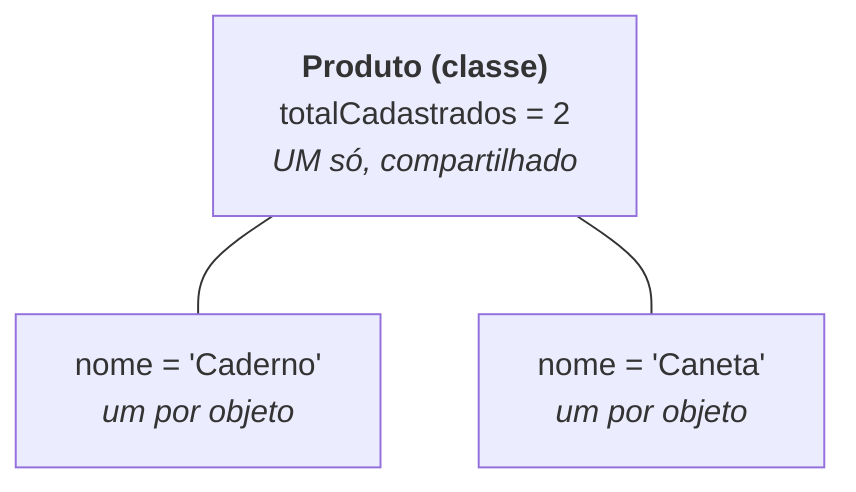

# Aula 06 — Encapsulamento

> 🎯 Objetivos: proteger os dados de um objeto com `private`, escrever getters e setters que **validam**, sobrecarregar construtores e distinguir o que é do objeto do que é da classe (`static`).

## 1. O problema de deixar tudo público

A `ContaBancaria` da aula passada tinha o saldo público. Então isto é legal:

```java
ContaBancaria conta = new ContaBancaria("Ana", "1001");
conta.saldo = 1_000_000;      // 🤑 sem depósito, sem registro, sem pergunta
conta.saldo = -50;            // e agora um saldo negativo impossível
```

A classe escreveu um método `sacar()` cuidadoso, com verificação de saldo... e qualquer linha de qualquer arquivo pode ignorá-lo. **Regras que podem ser contornadas não são regras.**

**Encapsulamento** é o primeiro pilar da POO: os dados de um objeto ficam **fechados**, e o mundo externo só interage através dos métodos que a classe oferece. A classe passa a ser a única responsável por manter seu estado válido.

## 2. `private` e os getters/setters

```java
public class ContaBancaria {
    private String titular;        // private = só esta classe enxerga
    private String numero;
    private double saldo;

    public ContaBancaria(String titular, String numero) {
        this.titular = titular;
        this.numero = numero;
        this.saldo = 0;
    }

    // GETTER: permite LER
    public double getSaldo() {
        return saldo;
    }

    public String getTitular() {
        return titular;
    }

    // SETTER: permite ESCREVER (e é aqui que a classe se defende)
    public void setTitular(String titular) {
        this.titular = titular;
    }
}
```

De fora, agora:

```java
conta.saldo = 1_000_000;             // ❌ error: saldo has private access in ContaBancaria
System.out.println(conta.getSaldo());  // ✅ 0.0
```

Convenção universal do Java: `getNomeDoAtributo()` para ler, `setNomeDoAtributo(valor)` para escrever, e `isAlgumaCoisa()` para getters de `boolean` (`isDisponivel()`).

> 💡 **Gere, não digite.** No IntelliJ, `Alt + Insert` → *Getter and Setter* escreve todos de uma vez.

> ⚠️ **Encapsulamento não é "criar getter e setter para tudo".** Se todo atributo tem os dois, você só trocou `conta.saldo = 1000` por `conta.setSaldo(1000)` — mesma bagunça, mais linhas. Pergunte sempre: *quem, de fora, tem o direito de mudar isto?* No caso do saldo: **ninguém** — ele só muda por depósito ou saque. Logo, `getSaldo()` sim, `setSaldo()` **não**.

## 3. O setter que defende a classe

O valor do setter aparece quando ele **rejeita** o que não faz sentido:

```java
public class Produto {
    private String nome;
    private double preco;
    private int estoque;

    public Produto(String nome, double preco) {
        this.nome = nome;
        setPreco(preco);            // reaproveita a validação já no nascimento!
        this.estoque = 0;
    }

    public void setPreco(double preco) {
        if (preco <= 0) {
            System.out.println("Preço inválido: " + preco + ". Mantido " + this.preco);
            return;                 // sai sem alterar nada
        }
        this.preco = preco;
    }

    public void adicionarEstoque(int quantidade) {
        if (quantidade <= 0) {
            System.out.println("Quantidade deve ser positiva.");
            return;
        }
        this.estoque += quantidade;
    }

    public boolean vender(int quantidade) {
        if (quantidade > estoque) {
            System.out.println("Estoque insuficiente. Disponível: " + estoque);
            return false;
        }
        this.estoque -= quantidade;
        return true;
    }
}
```

Repare que `vender()` e `adicionarEstoque()` **não são setters** — são operações do negócio. É assim que uma boa classe se parece: menos `set`, mais verbos de verdade.

> 💡 Por enquanto avisamos com `System.out.println` e `return`. Na Aula 10 você vai **lançar exceções**, que é o jeito profissional de dizer "isso não pode".

## 4. Sobrecarga de construtores

Assim como métodos, construtores podem ter várias versões:

```java
public class Produto {
    private String nome;
    private double preco;
    private int estoque;

    // Construtor completo
    public Produto(String nome, double preco, int estoque) {
        this.nome = nome;
        this.preco = preco;
        this.estoque = estoque;
    }

    // Versão curta: delega para o completo com this(...)
    public Produto(String nome, double preco) {
        this(nome, preco, 0);        // chama o outro construtor — precisa ser a 1ª linha
    }
}
```

```java
Produto a = new Produto("Caderno", 12.90, 50);
Produto b = new Produto("Caneta", 3.50);        // estoque começa em 0
```

`this(...)` chamando outro construtor evita duplicar código de validação. **Regra:** um construtor "principal" com tudo; os demais delegam para ele.

## 5. `static`: o que pertence à classe, não ao objeto

Um atributo comum existe **uma vez por objeto**. Um atributo `static` existe **uma vez só**, compartilhado por todos:

```java
public class Produto {
    private static int totalCadastrados = 0;      // um contador para a classe inteira
    public static final double DESCONTO_MAXIMO = 0.30;   // constante da classe

    private String nome;

    public Produto(String nome) {
        this.nome = nome;
        totalCadastrados++;                        // cada nascimento incrementa
    }

    public static int getTotalCadastrados() {      // método static: chamado na CLASSE
        return totalCadastrados;
    }
}
```

```java
new Produto("Caderno");
new Produto("Caneta");

System.out.println(Produto.getTotalCadastrados());   // 2  ← pela CLASSE, não pelo objeto
System.out.println(Produto.DESCONTO_MAXIMO);         // 0.3
```



> ⚠️ Um método `static` **não enxerga** atributos de instância — ele não sabe de qual objeto você fala. Tentar usar `nome` dentro de um método `static` dá `non-static variable nome cannot be referenced from a static context`. É exatamente o mesmo motivo pelo qual você não chama `calcularMedia()` direto do `main`.

Usos legítimos de `static`: contadores, constantes (`Math.PI`), e utilitários sem estado (`Math.max`, `Integer.parseInt`). Fora isso, desconfie: `static` demais é sinal de código que ainda pensa em procedimentos, não em objetos.

## 6. `toString()`: como o objeto se apresenta

Imprima um objeto sem mais nem menos e você verá isto:

```java
Produto p = new Produto("Caderno", 12.90, 50);
System.out.println(p);      // Produto@6d06d69c   😐
```

Isso é o nome da classe + o endereço em memória. Todo objeto Java já nasce com um método `toString()` (herdado, como você verá na Aula 07) — basta **sobrescrevê-lo**:

```java
@Override
public String toString() {
    return String.format("%s - R$ %.2f (%d em estoque)", nome, preco, estoque);
}
```

```java
System.out.println(p);      // Caderno - R$ 12,90 (50 em estoque)
```

O `System.out.println` chama `toString()` sozinho. A anotação `@Override` avisa o compilador: *"isto aqui é para substituir um método que já existe"* — se você errar o nome ou a assinatura, ele reclama na hora, em vez de deixar você criar um método novo sem querer.

> 💡 `toString()` é a ferramenta de depuração mais barata que existe. Implemente em **toda** classe do curso.

> 💻 **Código desta aula pronto para rodar:** [`Produto.java`](exemplos/Produto.java) + [`Loja.java`](exemplos/Loja.java)

## 🏋️ Exercícios da aula

Na pasta `aula-06/` do seu repositório:

1. **`ContaBancaria.java` + `Banco.java`** — reescreva a conta da Aula 05 com todos os atributos `private`; ofereça `getSaldo()` **sem** `setSaldo()`, mais `depositar`, `sacar` e `toString()`. Tente alterar o saldo direto no `main` e copie o erro do compilador num comentário;
2. **`Produto.java` + `Loja.java`** — implemente a classe da seção 3 completa (validação de preço, estoque, venda) e escreva um `main` que testa **todos** os caminhos: preço inválido, venda maior que o estoque, venda válida;
3. **`Aluno.java` + `Turma.java`** — na classe `Aluno`, o setter de nota deve rejeitar valores fora de 0–10; adicione um contador `static` de alunos matriculados e um `toString()` com nome, média e situação. Prove no `main` que o contador funciona;
4. **`Data.java`** — três construtores sobrecarregados: `Data(int dia, int mes, int ano)`, `Data(int dia, int mes)` (ano atual, 2026) e `Data()` (01/01/2026). Use `this(...)` para que os dois primeiros deleguem ao completo, e valide mês de 1 a 12;
5. **Desafio 🌶️ `CofrePorcos.java`** — um cofre que aceita moedas de 5, 10, 25, 50 centavos e R$ 1,00 (qualquer outro valor é rejeitado com aviso), guarda o total, conta quantas moedas de cada tipo entraram e só permite `quebrar()` se o total passar de R$ 20,00 — zerando tudo e devolvendo o valor. Nenhum atributo público, nenhum setter.

## 🧠 Revisão

[8 questões de múltipla escolha](revisao/README.md) para conferir se os conceitos ficaram sólidos. Responda sem consultar a aula — depois volte e corrija.

## ✅ Entrega

```bash
git add aula-06/
git commit -m "Resolve exercícios da aula 06 (encapsulamento)"
git push
```

---

⬅️ [Aula 05](../aula-05-classes-objetos/README.md) | ➡️ [Aula 07 — Herança](../aula-07-heranca/README.md)
