<!-- _class: capa -->

<div class="emoji">🔒</div>

# Encapsulamento

## Aula 06 · Bloco 2 — Os Pilares da POO

<div class="meta">O primeiro pilar: a classe protege o próprio estado</div>

---

## 🎯 Nesta aula

1. O problema de deixar **tudo público**
2. `private`, getters e setters
3. O setter que **defende** a classe
4. **Sobrecarga** de construtores
5. `static` e `toString()`

---

## O problema

A `ContaBancaria` da aula passada tinha o saldo público. Então isto é legal:

```java
conta.saldo = 1_000_000;      // 🤑 sem depósito, sem registro
conta.saldo = -50;            // e agora um saldo impossível
```

A classe escreveu um `sacar()` cuidadoso, com verificação de saldo — e **qualquer linha de qualquer arquivo pode ignorá-lo**.

---

<!-- _class: lead -->

## 📏 Regras que podem ser contornadas

# não são regras.

**Encapsulamento:** os dados ficam **fechados**, e o mundo externo só interage pelos métodos que a classe oferece.

A classe passa a ser a **única responsável** por manter o próprio estado válido.

---

## `private` e os getters/setters

```java
public class ContaBancaria {
    private String titular;     // private = só esta classe enxerga
    private double saldo;

    public double getSaldo() {          // GETTER: permite LER
        return saldo;
    }
    public void setTitular(String t) {  // SETTER: permite ESCREVER
        this.titular = t;
    }
}
```

De fora: `conta.saldo = 1000;` → ❌ `saldo has private access`

---

<!-- _class: lead -->

## ⚠️ Encapsulamento **não** é getter e setter para tudo

Se todo atributo tem os dois,
você só trocou `conta.saldo = 1000`
por `conta.setSaldo(1000)`.

Mesma bagunça, mais linhas.

**Pergunte sempre:** *quem, de fora, tem o direito de mudar isto?*

---

## No caso do saldo: ninguém

Ele só muda por **depósito** ou **saque**.

Logo: `getSaldo()` **sim**. `setSaldo()` **não**.

```java
public void adicionarEstoque(int quantidade) { ... }
public boolean vender(int quantidade) { ... }
```

Repare: esses **não são setters** — são operações do negócio.

É assim que uma boa classe se parece: **menos `set`, mais verbos de verdade**.

---

## O setter que defende a classe

```java
public void setPreco(double preco) {
    if (preco <= 0) {
        System.out.println("Preço inválido: " + preco);
        return;                 // sai sem alterar nada
    }
    this.preco = preco;
}

public Produto(String nome, double preco) {
    setPreco(preco);            // reaproveita a validação no nascimento!
}
```

O valor do setter aparece quando ele **rejeita** o que não faz sentido.

---

## Sobrecarga de construtores

```java
public Produto(String nome, double preco, int estoque) {   // completo
    this.nome = nome;
    this.preco = preco;
    this.estoque = estoque;
}

public Produto(String nome, double preco) {   // versão curta
    this(nome, preco, 0);      // precisa ser a PRIMEIRA linha
}
```

> 📏 Um construtor principal com tudo; os demais delegam com `this(...)`.

---

## `static`: o que é da classe, não do objeto

```java
public class Produto {
    private static int totalCadastrados = 0;   // UM para a classe inteira
    public static final double DESCONTO_MAXIMO = 0.30;   // constante

    public Produto(String nome) {
        totalCadastrados++;             // cada nascimento incrementa
    }
    public static int getTotalCadastrados() { return totalCadastrados; }
}

Produto.getTotalCadastrados();   // chamado na CLASSE, não no objeto
```

---

<!-- _class: diagrama -->

## Um por objeto × um para todos



---

## O limite do `static`

Um método `static` **não enxerga** atributos de instância — ele não sabe de qual objeto você fala:

```
non-static variable nome cannot be referenced
from a static context
```

É o mesmo motivo pelo qual você não chama `calcularMedia()` direto do `main`.

> ⚠️ Usos legítimos: contadores, constantes (`Math.PI`), utilitários sem estado (`Math.max`). Fora isso, desconfie: `static` demais é código que ainda pensa em procedimentos, não em objetos.

---

## `toString()`: como o objeto se apresenta

```java
System.out.println(p);      // Produto@6d06d69c   😐
```

Isso é o nome da classe + o endereço na memória. Sobrescreva:

```java
@Override
public String toString() {
    return String.format("%s - R$ %.2f (%d em estoque)", nome, preco, estoque);
}

System.out.println(p);      // Caderno - R$ 12,90 (50 em estoque)
```

O `println` chama `toString()` sozinho.

---

## Sobre o `@Override`

A anotação avisa o compilador: *"isto aqui substitui um método que já existe"*.

Se você errar o nome ou a assinatura, ele **reclama na hora** — em vez de deixar você criar um método novo sem querer.

> 💡 `toString()` é a ferramenta de depuração mais barata que existe. Implemente em **toda** classe do curso.

---

<!-- _class: checkpoint -->

## 🏋️ Exercícios da aula

Na pasta `aula-06/`:

1. **`ContaBancaria` + `Banco`** — tudo `private`, `getSaldo()` **sem** `setSaldo()`. Copie o erro do compilador num comentário;
2. **`Produto` + `Loja`** — validação de preço, estoque e venda. Teste **todos** os caminhos;
3. **`Aluno` + `Turma`** — setter de nota rejeitando fora de 0–10, contador `static`, `toString()`;
4. **`Data.java`** — três construtores sobrecarregados, delegando com `this(...)`;
5. **Desafio 🌶️ `CofrePorcos.java`** — nenhum atributo público, nenhum setter.

---

<!-- _class: lead -->

## ➡️ Próxima aula

**Aula 07 — Herança**

O segundo pilar: quando duas classes
são quase iguais.
