<!-- _class: capa -->

<div class="emoji">🌳</div>

# Herança

## Aula 07 · Bloco 2 — Os Pilares da POO

<div class="meta">Reaproveitar código — e saber quando não usar</div>

---

## 🎯 Nesta aula

1. O problema: **copiar e colar entre classes**
2. `extends`, `super` e `protected`
3. Todo mundo herda de **`Object`**
4. **Sobrescrita**, `equals()` e `hashCode()`
5. **Quando não herdar** — prefira composição

---

## O problema

```java
public class Aluno {          public class Professor {
    private String nome;          private String nome;      ┐
    private String cpf;           private String cpf;       │ igual
    private int idade;            private int idade;        ┘
    private String matricula;     private double salario;
}                             }
```

---

<!-- _class: lead -->

## 🔍 Existe um conceito escondido

**Pessoa.**

Aluno *é uma* pessoa. Professor *é uma* pessoa.

Sem dizer isso em código, o dia em que o CPF passar a exigir validação
você vai alterar **dois** arquivos — e esquecer um.

Amanhã entra `Funcionario`, e são três.

---

<!-- _class: diagrama -->

## A hierarquia



---

## `extends` e `super`

```java
public class Aluno extends Pessoa {      // "Aluno é uma Pessoa"
    private String matricula;

    public Aluno(String nome, String cpf, int idade, String matricula) {
        super(nome, cpf, idade);   // construtor da mãe — 1ª LINHA!
        this.matricula = matricula;
    }
}

ana.getNome();          // herdado de Pessoa
ana.ehMaiorDeIdade();   // herdado
ana.calcularMedia();    // próprio de Aluno
```

---

## `protected`: o nível de acesso que a herança pede

| Modificador | Quem enxerga |
|---|---|
| `private` | só a própria classe |
| `protected` | a própria classe **e as subclasses** |
| `public` | todo mundo |

O meio-termo: a subclasse acessa o atributo direto, o resto do mundo não.

> 💡 Vocabulário: `Pessoa` é a **superclasse**; `Aluno` e `Professor` são **subclasses**.

---

<!-- _class: lead -->

## A ordem dos construtores

```
new Aluno("Ana");

1 - Construtor de Pessoa
2 - Construtor de Aluno
```

**Primeiro a mãe, depois a filha** — sempre.

Faz sentido: a parte `Pessoa` do objeto precisa existir
antes de a parte `Aluno` ser construída em cima dela.

---

## ⚠️ O erro que vem daí

`super(...)` tem de ser a **primeira linha** do construtor.

Se você não escrever, o compilador insere um `super()` sem argumentos. E se a superclasse não tiver construtor vazio:

```
constructor Pessoa in class Pessoa
cannot be applied to given types
```

**A cura:** chamar `super(...)` com os argumentos certos.

---

## Todo mundo herda de `Object`

Você já usou herança sem saber. Toda classe que não estende ninguém **estende `Object`**.

De lá vêm métodos que você já viu:

- `toString()` — a apresentação em texto;
- `equals(Object o)` — comparação;
- `hashCode()` — o "código de arquivamento" usado por coleções.

As versões originais são propositalmente burras. Cabe a você sobrescrevê-las.

---

## Sobrescrita: mudando o comportamento herdado

```java
@Override
public String toString() {
    return super.toString() + " - matrícula " + matricula;
}                // ↑ super.toString() reaproveita a versão da mãe

System.out.println(p);    // Carlos (999)
System.out.println(a);    // Ana (111) - matrícula 1001
```

Mesma chamada, comportamentos diferentes. **Isso já é polimorfismo** — aula 08.

---

<!-- _class: lead -->

## ⚠️ Use **sempre** `@Override`

Escrever `toString(String s)` por engano
cria uma **sobrecarga nova**, que ninguém chama.

O comportamento antigo continua valendo.
Um bug silencioso.

Com `@Override`, o compilador denuncia na hora.

---

## `equals()`: dois objetos com os mesmos dados são iguais?

Por padrão, **não**:

```java
Aluno a1 = new Aluno("Ana", "111", 19, "1001");
Aluno a2 = new Aluno("Ana", "111", 19, "1001");

a1 == a2          // false — objetos distintos na memória
a1.equals(a2)     // false — o equals herdado só compara referências
```

Você decide o critério. Para `Aluno`: mesma **matrícula**, mesmo aluno.

---

## Sobrescrevendo `equals`

```java
@Override
public boolean equals(Object obj) {
    if (this == obj) return true;                // é o mesmo objeto
    if (!(obj instanceof Aluno)) return false;   // nem é Aluno
    Aluno outro = (Aluno) obj;
    return this.matricula.equals(outro.matricula);   // o critério
}
```

---

<!-- _class: lead -->

## ⚠️ Sobrescreveu `equals`? Sobrescreva `hashCode`

Sempre com **os mesmos atributos**.

`HashMap` e `HashSet` usam o `hashCode` para achar o objeto
e só depois o `equals` para confirmar.

Com um sem o outro, **o objeto some dentro da coleção**.

No IntelliJ: `Alt + Insert` → *equals() and hashCode()*

---

<!-- _class: lead -->

## 📏 Quando **não** herdar

Herança é a relação mais forte entre duas classes —
e por isso a mais fácil de usar errado.

O teste é uma frase:

# "Todo X é um Y"

Se soa estranho, **não é herança**.

---

## Composição: "tem um"

```java
// ❌ Todo Cliente é um Endereço?  Não.
public class Cliente extends Endereco { }

// ✅ Todo Cliente TEM um Endereço
public class Cliente {
    private Endereco endereco;    // um objeto dentro de outro
}
```

`Carro` **tem** um `Motor`. `Pedido` **tem** vários `Item`. `Aluno` **é** uma `Pessoa`.

> 💡 Na dúvida, **componha**: é mais flexível e não amarra sua classe à evolução da outra. Hierarquia boa tem 2 ou 3 níveis, no máximo.

---

<!-- _class: checkpoint -->

## 🏋️ Exercícios da aula

Na pasta `aula-07/`:

1. **`Pessoa` + `Aluno` + `Professor` + `Escola`** — a hierarquia completa com `super.toString()`;
2. **`Ordem.java`** — três níveis, um `println` em cada construtor. Anote a ordem e explique;
3. **`Aluno` (equals)** — por matrícula. Depois **comente** o `@Override` e veja o que muda;
4. **`Veiculo` + `Carro` + `Moto`** — `Moto` sobrescreve `calcularIpva()` para 2%;
5. **Desafio 🌶️ `Funcionario` + subclasses** — o mesmo laço tratando três tipos. É o gancho da aula 08.

---

<!-- _class: lead -->

## ➡️ Próxima aula

**Aula 08 — Polimorfismo e Abstração**

O último pilar — e o que dá à POO seu superpoder:
código que funciona com objetos que **ainda não existem**.
