<!-- _class: capa -->

<div class="emoji">🛡️</div>

# Exceções

## Aula 10 · Bloco 3 — POO na Prática

<div class="meta">Que o programa não quebre na mão do usuário</div>

---

## 🎯 Nesta aula

1. O programa que quebra na primeira digitação errada
2. `try` / `catch` / `finally`
3. ***Checked*** × ***unchecked***
4. `throw` — lançando as suas
5. **Exceções personalizadas** e `try-with-resources`

---

## O programa que morre

```java
System.out.print("Sua idade: ");
int idade = scanner.nextInt();     // usuário digita "vinte"
```

```
Exception in thread "main" java.util.InputMismatchException
	at java.base/java.util.Scanner.throwFor(Scanner.java:964)
```

Não imprimiu nada, não salvou nada, não avisou nada compreensível.

Em sistema real isso é inaceitável — e **a culpa não é do usuário**.

---

<!-- _class: lead -->

## 💡 O *stack trace* não é castigo

É **mapa**.

A primeira linha diz **o que** aconteceu.
As linhas `at ...` mostram **o caminho** até lá.

Procure a primeira linha que cita **uma classe sua**:
é ali que começa a investigação.

---

## `try` / `catch` / `finally`

```java
try {
    int idade = scanner.nextInt();      // o trecho arriscado
} catch (InputMismatchException e) {
    System.out.println("Digite um número inteiro.");
    scanner.nextLine();                 // limpa a entrada inválida!
} finally {
    System.out.println("Leitura encerrada.");   // roda SEMPRE
}
```

- **`try`** — se der erro no meio, o **restante do bloco é pulado**;
- **`catch`** — o plano B para **aquele tipo**;
- **`finally`** — executa deu certo ou não. Para liberar recursos.

---

## Vários `catch`, do específico ao genérico

```java
try {
    System.out.println(numeros[5]);
} catch (ArrayIndexOutOfBoundsException e) {
    System.out.println("Índice inválido: " + e.getMessage());
} catch (ArithmeticException e) {
    System.out.println("Erro de cálculo");
} catch (Exception e) {         // rede de segurança
    System.out.println("Erro inesperado");
}
```

> ⚠️ O `catch (Exception e)` **vem por último**: ele pega tudo, e qualquer `catch` depois fica inalcançável.

---

<!-- _class: lead -->

## ⚠️ Nunca deixe um `catch` vazio

```
} catch (Exception e) {
}
```

Engolir a exceção sem dizer nada
é a **pior** coisa que se pode fazer com um erro.

O problema continua lá — só que agora invisível.

---

## Um laço de leitura à prova de bala

```java
int idade = -1;
while (idade < 0) {
    try {
        idade = Integer.parseInt(scanner.nextLine());
    } catch (NumberFormatException e) {
        System.out.println("Valor inválido. Tente de novo.");
    }
}
```

> 💡 Ler com `nextLine()` + `Integer.parseInt()` **elimina de uma vez** a pegadinha do `nextInt()` deixando o Enter no buffer. Adote esse padrão nos seus menus.

---

<!-- _class: diagrama -->

## A família `Throwable`



---

<!-- _class: tabela-densa -->

## *Checked* × *unchecked*

| | *Unchecked* | *Checked* |
|---|---|---|
| **O compilador obriga a tratar?** | não | **sim** |
| **Origem típica** | bug de programação | fator externo: arquivo, rede |
| **Exemplos** | `NullPointerException` | `IOException` |
| **O que fazer** | **corrigir o código** | tratar ou declarar `throws` |

Ignorar uma *checked* nem compila. É o que acontece na aula 13, com arquivos.

> 💡 **Não trate `NullPointerException` com `try/catch`** — ela é um **bug**, não um imprevisto. Conserte a causa.

---

## `throw`: lançando as suas

```java
public void sacar(double valor) {
    if (valor <= 0) {
        throw new IllegalArgumentException("Saque deve ser positivo.");
    }
    if (valor > saldo) {
        throw new IllegalStateException("Saldo insuficiente.");
    }
    this.saldo -= valor;
}
```

Na aula 06 isso virava um `println` — e **quem chamou não ficava sabendo**. Agora a classe **não deixa** o objeto entrar em estado inválido.

---

## E quem chama decide o que fazer

```java
try {
    conta.sacar(500);
    System.out.println("Saque realizado!");
} catch (IllegalArgumentException | IllegalStateException e) {
    System.out.println("Não foi possível sacar: " + e.getMessage());
}
```

> 💡 **Essa é a divisão de responsabilidades que a POO busca:** a classe garante suas regras; a interface com o usuário decide como comunicar a falha. A mesma `ContaBancaria` serve para um app, um site ou um menu de terminal.

---

## Exceções personalizadas

```java
public class SaldoInsuficienteException extends RuntimeException {
    private final double falta;

    public SaldoInsuficienteException(double saldo, double solicitado) {
        super(String.format("Disponível R$ %.2f, pedido R$ %.2f",
                            saldo, solicitado));
        this.falta = solicitado - saldo;
    }
    public double getFalta() { return falta; }
}
```

Quando o problema é do **seu domínio**, dê a ele o nome dele.

---

## O que se ganha

```java
catch (SaldoInsuficienteException e) {
    System.out.printf("Faltam R$ %.2f. Deseja depositar?%n", e.getFalta());
}
```

- 📛 O **nome documenta** o erro;
- 🎯 O `catch` pode ser **específico**;
- 🎒 A exceção **carrega dados úteis**.

> 📏 Estenda `RuntimeException` para violação de regra de negócio — é o padrão do curso. Estenda `Exception` quando quiser **obrigar** quem chama a tratar.

---

## `try-with-resources`

Recursos que precisam ser fechados têm sintaxe própria:

```java
try (Scanner scanner = new Scanner(System.in)) {
    System.out.println("Olá, " + scanner.nextLine());
}   // scanner.close() acontece sozinho aqui — mesmo se der erro
```

Compare com o `finally` que você teria de escrever à mão. E esquecer.

> 💡 Este é o padrão **obrigatório** da aula 13, com arquivos.

---

<!-- _class: checkpoint -->

## 🏋️ Exercícios da aula

Na pasta `aula-10/`:

1. **`LeituraSegura.java`** — `lerInteiro(...)` que insiste até receber válido;
2. **`ContaBancaria` + `Caixa`** — troque os `println` por `throw`;
3. **`SaldoInsuficienteException` + `Banco`** — a exceção com `getFalta()`;
4. **`Cadastro.java`** — quatro casos, um válido e três inválidos;
5. **Desafio 🌶️ `Biblioteca.java`** — **três** exceções próprias, menu que **nunca** quebra. É o esboço do projeto da aula 12.

---

<!-- _class: lead -->

## ➡️ Próxima aula

**Aula 11 — Organização do Código**

Pacotes, `import` e como um projeto
de verdade se estrutura.
