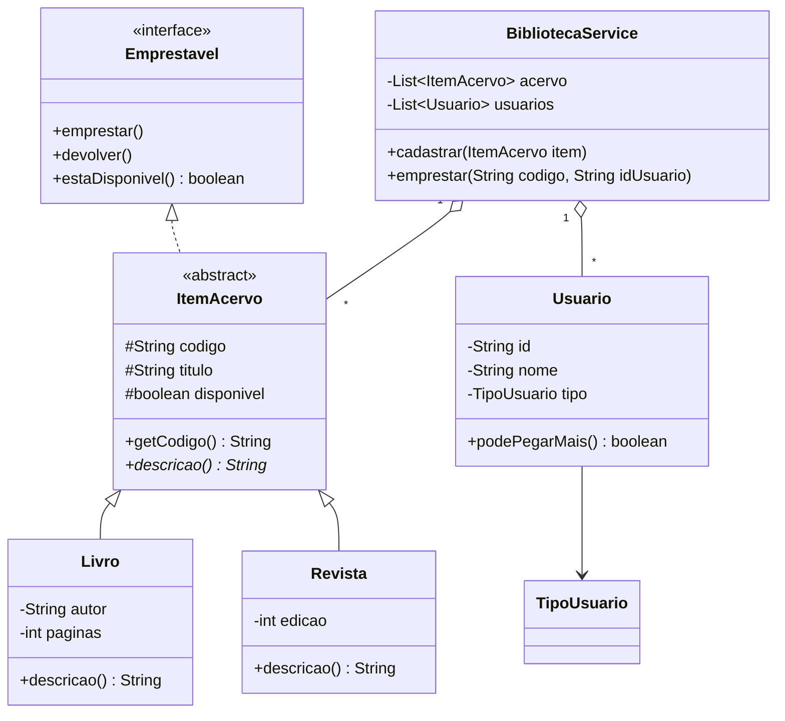

# Aula 11 — Organização do Código

> 🎯 Objetivos: organizar classes em pacotes e camadas, usar `enum` e `record` nos lugares certos, documentar com Javadoc e ler um diagrama de classes.
> 🎬 Slides da aula: [apresentacao-11-organizacao-pacotes.pdf](apresentacao/apresentacao-11-organizacao-pacotes.pdf)

Até aqui, cada exercício tinha 3 ou 4 classes soltas numa pasta. Um sistema de verdade tem 30 — e a diferença entre um projeto que se mantém e um que apodrece está nesta aula.

## 1. Pacotes

Pacote é a pasta com endereço: agrupa classes relacionadas e evita colisão de nomes (existem várias classes `Cliente` no mundo).

```
src/
└── biblioteca/
    ├── model/
    │   ├── Livro.java
    │   └── Usuario.java
    ├── service/
    │   └── BibliotecaService.java
    └── app/
        └── Main.java
```

A primeira linha de cada arquivo declara onde ele mora, e o caminho **tem que bater com as pastas**:

```java
package biblioteca.model;

public class Livro {
    // ...
}
```

Para usar uma classe de outro pacote, `import`:

```java
package biblioteca.service;

import biblioteca.model.Livro;          // classe específica
import java.util.ArrayList;
import java.util.List;

public class BibliotecaService {
    private List<Livro> acervo = new ArrayList<>();
}
```

> 💡 Classes do mesmo pacote se enxergam sem `import`. E `java.lang` (`String`, `System`, `Math`, `Integer`) é importado automaticamente — por isso você nunca precisou importar `String`.

Convenção de nomes: tudo **minúsculo**, sem acento, do mais geral ao mais específico (`br.edu.escola.biblioteca.model`). No curso, `biblioteca.model` basta.

> ⚠️ Compilar pacotes na mão exige atenção ao diretório-raiz: `javac -d out $(find src -name "*.java")` e depois `java -cp out biblioteca.app.Main`. Na IDE isso é automático — mais um motivo para usar o IntelliJ a partir daqui.

## 2. Camadas: cada pacote com um papel

O nome das pastas não é decoração; ele expressa **responsabilidade**:

| Camada | Papel | Nunca faz |
|--------|-------|-----------|
| `model` | representa o domínio: `Livro`, `Usuario`. Guarda dados e regras do **próprio** objeto | não imprime nada, não lê teclado |
| `service` | orquestra as regras do sistema: cadastrar, emprestar, buscar. Guarda as coleções | não imprime nada, não lê teclado |
| `app` (ou `view`) | conversa com o usuário: menu, `Scanner`, `System.out` | não contém regra de negócio |

A regra de ouro: **`System.out.println` só na camada `app`.** Parece detalhe, mas é o que permite trocar o menu de terminal por uma tela gráfica sem tocar em `model` e `service`.

```java
// ❌ regra de negócio misturada com interface
public void emprestar(String titulo) {
    Livro l = buscar(titulo);
    if (l == null) {
        System.out.println("Livro não encontrado!");   // service não fala com o usuário
        return;
    }
}

// ✅ o service decide e avisa por exceção; o app traduz para o usuário
public void emprestar(String titulo) {
    Livro l = buscar(titulo);
    if (l == null) {
        throw new LivroNaoEncontradoException(titulo);
    }
    l.emprestar();
}
```

## 3. `enum`: um conjunto fechado de valores

Status como texto é um convite a bug: `"ativo"`, `"Ativo"`, `"atvio"`...

```java
public enum StatusEmprestimo {
    ATIVO,
    DEVOLVIDO,
    ATRASADO
}
```

```java
StatusEmprestimo status = StatusEmprestimo.ATIVO;

if (status == StatusEmprestimo.ATRASADO) {           // == é seguro em enum!
    System.out.println("Cobrar multa");
}

switch (status) {
    case ATIVO -> System.out.println("Em dia");
    case DEVOLVIDO -> System.out.println("Finalizado");
    case ATRASADO -> System.out.println("Em atraso");
}

for (StatusEmprestimo s : StatusEmprestimo.values()) {   // todos os valores
    System.out.println(s);
}
```

Enums podem ter atributos e métodos — são classes especiais:

```java
public enum TipoUsuario {
    ALUNO(3, 7),                       // 3 livros, 7 dias
    PROFESSOR(10, 30),
    VISITANTE(1, 3);

    private final int limiteItens;
    private final int diasEmprestimo;

    TipoUsuario(int limiteItens, int diasEmprestimo) {
        this.limiteItens = limiteItens;
        this.diasEmprestimo = diasEmprestimo;
    }

    public int getLimiteItens() {
        return limiteItens;
    }

    public int getDiasEmprestimo() {
        return diasEmprestimo;
    }
}
```

```java
TipoUsuario tipo = TipoUsuario.PROFESSOR;
System.out.println(tipo.getLimiteItens());     // 10
```

Regras que antes viviam espalhadas em `if` agora moram no próprio tipo.

## 4. `record`: dados imutáveis sem cerimônia

Algumas classes só carregam dados. Escrever construtor, getters, `equals`, `hashCode` e `toString` para elas é ritual vazio — o `record` (Java 16+) faz tudo:

```java
public record Endereco(String rua, String cidade, String uf) { }
```

Essa linha gera: construtor, os métodos de acesso `rua()`, `cidade()`, `uf()`, além de `equals`, `hashCode` e `toString`.

```java
Endereco e = new Endereco("Rua A", "Vitória", "ES");
System.out.println(e.cidade());     // Vitória
System.out.println(e);              // Endereco[rua=Rua A, cidade=Vitória, uf=ES]
```

Records são **imutáveis**: não há setters, os campos são `final`. Perfeitos para coordenadas, endereços, itens de relatório. Use classe normal quando o objeto tem **comportamento** e **estado que muda** (`ContaBancaria`, `Livro`).

Validação vai no construtor compacto:

```java
public record Endereco(String rua, String cidade, String uf) {
    public Endereco {
        if (uf.length() != 2) {
            throw new IllegalArgumentException("UF deve ter 2 letras");
        }
    }
}
```

## 5. Convenções e Javadoc

O Java tem convenções que **todo** projeto segue — respeitá-las é parte de escrever código profissional:

| Elemento | Convenção | Exemplo |
|----------|-----------|---------|
| Classe, interface, enum | PascalCase | `BibliotecaService` |
| Método, variável | camelCase, verbo em métodos | `calcularMulta()` |
| Constante | MAIÚSCULA_COM_UNDERLINE | `LIMITE_MAXIMO` |
| Pacote | tudo minúsculo | `biblioteca.model` |
| Valor de enum | MAIÚSCULA | `ATIVO` |

Javadoc é o comentário `/** ... */` que vira documentação navegável (é dele que sai o site da API do Java):

```java
/**
 * Registra o empréstimo de um livro para um usuário.
 *
 * @param isbn       código do livro desejado
 * @param idUsuario  identificador do usuário solicitante
 * @return o empréstimo criado, com a data de devolução calculada
 * @throws LivroNaoEncontradoException se não existir livro com o ISBN informado
 * @throws LivroIndisponivelException  se o livro já estiver emprestado
 */
public Emprestimo emprestar(String isbn, String idUsuario) {
    // ...
}
```

> 💡 Documente **o que não está óbvio no código**: regras, unidades, o que acontece em caso de erro. Um Javadoc que só repete o nome do método (`// calcula a multa`) é ruído.

## 6. Lendo um diagrama de classes

Antes de escrever o projeto da próxima aula, olhe o desenho dele:



Leia assim: `Livro` e `Revista` **são** itens do acervo (triângulo vazio); `ItemAcervo` **cumpre o contrato** `Emprestavel` (linha tracejada); o serviço **possui** listas de itens e de usuários (losango). Notação completa no [guia de diagrama de classes](../../recursos/diagrama-de-classes.md).

> 💻 **Código desta aula pronto para rodar:** [`TipoUsuario.java`](exemplos/TipoUsuario.java), [`Endereco.java`](exemplos/Endereco.java) + [`Demo.java`](exemplos/Demo.java)

## 🏋️ Exercícios da aula

Na pasta `aula-11/` do seu repositório:

1. **`Reorganizar/`** — pegue o desafio da Aula 10 (biblioteca) e reorganize em pacotes `model`, `service` e `app`, tirando **todo** `System.out` de fora da camada `app`. Rode pela IDE e confira que continua funcionando;
2. **`StatusPedido.java` + `Pedido.java`** — um `enum` com `AGUARDANDO`, `PAGO`, `ENVIADO`, `ENTREGUE`, `CANCELADO`; a classe `Pedido` só permite avançar para o próximo status válido (não se cancela um pedido já entregue) e lança exceção nas transições inválidas;
3. **`TipoUsuario.java`** — implemente o enum com atributos da seção 3 e use-o numa classe `Usuario` para decidir quantos itens ela pode pegar emprestados;
4. **`Coordenada.java` + `Endereco.java`** — crie dois `record` com validação no construtor compacto e mostre no `main` o `toString` e o `equals` funcionando de graça (dois records com os mesmos dados são iguais);
5. **Desafio 🌶️ `DiagramaDoSeuProjeto.md`** — escolha um sistema do seu dia a dia (academia, lanchonete, escala de plantão) e produza: (a) a lista de classes com atributos e métodos, (b) um diagrama Mermaid com **pelo menos** uma herança, uma interface e uma composição, e (c) o Javadoc dos três métodos principais — **sem escrever o código**. Guarde: pode virar o sistema do laboratório da Aula 15.

### 📤 Entrega

Estes exercícios são feitos em sala e vão para o **seu repositório** `exercicios-java-poo`:

```bash
cd ..                 # da pasta da aula para a raiz do repositório
git add aula-11/
git commit -m "Resolve exercícios da aula 11"
git push
```

Confira no navegador que a pasta apareceu em `github.com/SEU-USUARIO/exercicios-java-poo`.

## 🧠 Revisão

[8 questões de múltipla escolha](revisao/README.md) para conferir se os conceitos ficaram sólidos. Responda sem consultar a aula — depois volte e corrija.

---

⬅️ [Aula 10](../aula-10-excecoes/README.md) | ➡️ [Aula 12 — Projeto Guiado](../aula-12-projeto-biblioteca/README.md)
