<!-- _class: capa -->

<div class="emoji">🗂️</div>

# Organização do Código

## Aula 11 · Bloco 3 — POO na Prática

<div class="meta">A diferença entre um projeto que se mantém e um que apodrece</div>

---

## 🎯 Nesta aula

1. **Pacotes** — a pasta com endereço
2. **Camadas** — cada pacote com um papel
3. **`enum`** — conjunto fechado de valores
4. **`record`** — dados imutáveis sem cerimônia
5. Convenções, Javadoc e o **diagrama de classes**

---

## O problema de escala

Até aqui, cada exercício tinha 3 ou 4 classes soltas numa pasta.

Um sistema de verdade tem **30**.

E a diferença entre um projeto que se mantém e um que apodrece está exatamente nesta aula.

---

## Pacotes

```
src/biblioteca/
├── model/      → Livro.java, Usuario.java
├── service/    → BibliotecaService.java
└── app/        → Main.java
```

```java
package biblioteca.model;      // 1ª linha — TEM de bater com as pastas
import biblioteca.model.Livro;
```

> 💡 Classes do mesmo pacote se enxergam sem `import`. E `java.lang` é importado sozinho — por isso você nunca importou `String`.

---

<!-- _class: tabela-densa -->

## Camadas: o nome da pasta é responsabilidade

| Camada | Papel | **Nunca faz** |
|---|---|---|
| `model` | representa o domínio: `Livro`, `Usuario`. Dados e regras do próprio objeto | não imprime, não lê teclado |
| `service` | orquestra as regras do sistema: cadastrar, emprestar, buscar | não imprime, não lê teclado |
| `app` | conversa com o usuário: menu, `Scanner`, `System.out` | não contém regra de negócio |

---

<!-- _class: lead -->

## 📏 A regra de ouro

# `System.out.println` só na camada `app`.

Parece detalhe. É o que permite trocar o menu de terminal
por uma tela gráfica **sem tocar** em `model` e `service`.

---

## Como isso se parece no código

```java
// ❌ regra de negócio misturada com interface
public void emprestar(String titulo) {
    Livro l = buscar(titulo);
    if (l == null) {
        System.out.println("Não encontrado!");   // service falando!
        return;
    }
}

// ✅ o service decide e avisa por exceção; o app traduz
public void emprestar(String titulo) {
    if (buscar(titulo) == null) throw new LivroNaoEncontradoException();
}
```

---

## `enum`: um conjunto fechado

Status como texto é convite a bug: `"ativo"`, `"Ativo"`, `"atvio"`…

```java
public enum StatusEmprestimo { ATIVO, DEVOLVIDO, ATRASADO }
```

```java
if (status == StatusEmprestimo.ATRASADO) { ... }   // == é seguro aqui!

switch (status) {
    case ATIVO -> System.out.println("Em dia");
    case ATRASADO -> System.out.println("Em atraso");
}
for (StatusEmprestimo s : StatusEmprestimo.values()) { ... }
```

---

## Enum com atributos e métodos

```java
public enum TipoUsuario {
    ALUNO(3, 7),                    // 3 livros, 7 dias
    PROFESSOR(10, 30),
    VISITANTE(1, 3);

    private final int limiteItens;

    TipoUsuario(int limiteItens, int diasEmprestimo) { ... }
    public int getLimiteItens() { return limiteItens; }
}
```

> 💡 Regras que antes viviam espalhadas em `if` agora moram **no próprio tipo**.

---

## `record`: dados sem cerimônia

Algumas classes só **carregam dados**. Escrever construtor, getters, `equals`, `hashCode` e `toString` para elas é ritual vazio.

```java
public record Endereco(String rua, String cidade, String uf) { }
```

Essa **única linha** gera todos eles.

```java
Endereco e = new Endereco("Rua A", "Vitória", "ES");
e.cidade();          // Vitória
System.out.println(e);  // Endereco[rua=Rua A, cidade=Vitória, uf=ES]
```

---

## Quando `record`, quando classe

**`record`** é **imutável**: sem setters, campos `final`. Perfeito para coordenadas, endereços, itens de relatório.

**Classe normal** quando o objeto tem **comportamento** e **estado que muda** — `ContaBancaria`, `Livro`.

Validação vai no construtor compacto:

```java
public record Endereco(String rua, String cidade, String uf) {
    public Endereco {
        if (uf.length() != 2) throw new IllegalArgumentException("UF: 2 letras");
    }
}
```

---

<!-- _class: tabela-densa -->

## As convenções que todo projeto Java segue

| Elemento | Convenção | Exemplo |
|---|---|---|
| Classe, interface, enum | PascalCase | `BibliotecaService` |
| Método, variável | camelCase, verbo em métodos | `calcularMulta()` |
| Constante | MAIÚSCULA_COM_UNDERLINE | `LIMITE_MAXIMO` |
| Pacote | tudo minúsculo | `biblioteca.model` |
| Valor de enum | MAIÚSCULA | `ATIVO` |

Respeitá-las é parte de escrever código profissional.

---

## Javadoc

```java
/**
 * Registra o empréstimo de um livro para um usuário.
 *
 * @param isbn       código do livro desejado
 * @param idUsuario  identificador do solicitante
 * @return o empréstimo criado, com a data de devolução
 * @throws LivroNaoEncontradoException se não existir livro com o ISBN
 */
public Emprestimo emprestar(String isbn, String idUsuario) { ... }
```

> 💡 Documente **o que não está óbvio no código**: regras, unidades, o que acontece em caso de erro. Javadoc que repete o nome do método é ruído.

---

<!-- _class: diagrama -->

## O projeto da próxima aula, desenhado



---

## Como ler o diagrama

- **Triângulo vazio** — `Livro` e `Revista` **são** itens do acervo;
- **Linha tracejada** — `ItemAcervo` **cumpre o contrato** `Emprestavel`;
- **Losango** — o serviço **possui** listas de itens e de usuários.

Antes de escrever o projeto, olhe o desenho dele. Modelar no papel custa minutos; refatorar código custa horas.

---

<!-- _class: checkpoint -->

## 🏋️ Exercícios da aula

Na pasta `aula-11/`:

1. **`Reorganizar/`** — a biblioteca da aula 10 em `model`, `service`, `app`. **Todo** `System.out` fora do `app` sai;
2. **`StatusPedido` + `Pedido`** — só permite avançar para o status válido;
3. **`TipoUsuario.java`** — o enum com atributos, decidindo o limite de itens;
4. **`Coordenada` + `Endereco`** — dois `record` com validação;
5. **Desafio 🌶️** — modele um sistema do seu dia a dia. **Sem escrever código.** Pode virar o sistema da Aula 15.

---

<!-- _class: lead -->

## ➡️ Próxima aula

**Aula 12 — Projeto Guiado: Biblioteca**

Tudo dos blocos 2 e 3, num sistema só.
