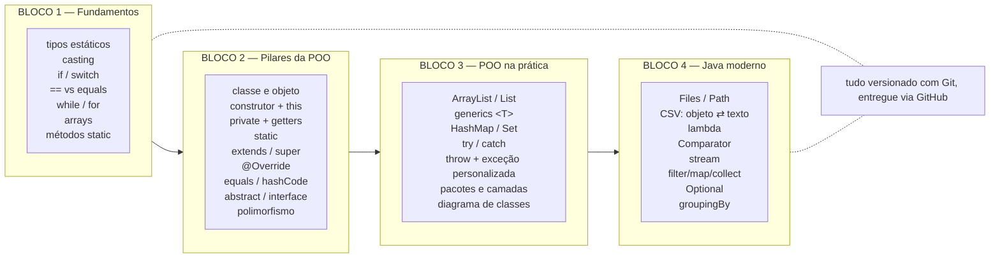

# Aula 16 — Revisão e Próximos Passos

> 🎯 Objetivos: consolidar o mapa do curso, ver os quatro pilares num exemplo só, experimentar testes automatizados e saber o que estudar depois.
> 🎬 Slides da aula: [apresentacao-16-revisao-proximos-passos.pdf](apresentacao/apresentacao-16-revisao-proximos-passos.pdf)

## 1. O mapa do curso em uma tela



Repare como cada bloco usou o anterior: os métodos (B1) viraram comportamento de objeto (B2); o `equals` (B2) passou a ser exigido pelas coleções (B3); as coleções (B3) viraram fluxos de dados (B4); as exceções (B3) protegeram a leitura de arquivo (B4). Programação é acumulativa.

## 2. Os quatro pilares num exemplo só

Se alguém pedir os quatro pilares numa entrevista, este exemplo responde todos:

```java
// ABSTRAÇÃO: o que é um funcionário, sem dizer de que tipo
public abstract class Funcionario {
    // ENCAPSULAMENTO: estado protegido, acesso controlado
    private String nome;
    private double salarioBase;

    public Funcionario(String nome, double salarioBase) {
        this.nome = nome;
        setSalarioBase(salarioBase);          // valida já no nascimento
    }

    public void setSalarioBase(double salarioBase) {
        if (salarioBase < 1518) {
            throw new IllegalArgumentException("Abaixo do salário mínimo");
        }
        this.salarioBase = salarioBase;
    }

    protected double getSalarioBase() { return salarioBase; }
    public String getNome() { return nome; }

    public abstract double calcularSalario();       // cada tipo calcula do seu jeito
}

// HERANÇA: reaproveita nome, salário e validação
public class Gerente extends Funcionario {
    public Gerente(String nome, double salarioBase) {
        super(nome, salarioBase);
    }

    @Override
    public double calcularSalario() {
        return getSalarioBase() * 1.20;
    }
}

public class Vendedor extends Funcionario {
    private double vendasDoMes;

    public Vendedor(String nome, double salarioBase, double vendasDoMes) {
        super(nome, salarioBase);
        this.vendasDoMes = vendasDoMes;
    }

    @Override
    public double calcularSalario() {
        return getSalarioBase() + vendasDoMes * 0.05;
    }
}
```

```java
// POLIMORFISMO: um laço, comportamentos diferentes
List<Funcionario> folha = List.of(
        new Gerente("Ana", 8000),
        new Vendedor("Léo", 2000, 30000));

double total = folha.stream()
        .mapToDouble(Funcionario::calcularSalario)
        .sum();

folha.forEach(f -> System.out.printf("%s: R$ %.2f%n", f.getNome(), f.calcularSalario()));
System.out.printf("Total da folha: R$ %.2f%n", total);
```

Saída:

```
Ana: R$ 9600,00
Léo: R$ 3500,00
Total da folha: R$ 13100,00
```

Trinta linhas com **abstração** (classe abstrata), **encapsulamento** (private + validação), **herança** (`extends`) e **polimorfismo** (o laço que trata os dois tipos igual). Se você entende cada linha daí, o curso cumpriu o objetivo.

## 3. Degustação: testes automatizados com JUnit

Até aqui, você testava rodando o programa e conferindo com os olhos. Isso não escala: a cada mudança seria preciso repetir tudo na mão. **Teste automatizado** é código que verifica código.

```java
import org.junit.jupiter.api.Test;
import static org.junit.jupiter.api.Assertions.*;

class GerenteTest {

    @Test
    void gerenteRecebeVintePorCentoDeBonus() {
        Gerente gerente = new Gerente("Ana", 8000);
        assertEquals(9600, gerente.calcularSalario(), 0.01);
    }

    @Test
    void salarioAbaixoDoMinimoEhRejeitado() {
        assertThrows(IllegalArgumentException.class,
                () -> new Gerente("Léo", 500));
    }
}
```

Cada `@Test` é um cenário; `assertEquals` confere um resultado; `assertThrows` confere que a exceção **certa** foi lançada. A IDE roda tudo com um clique e mostra verde ou vermelho.

Por que isso muda a vida: com testes, mexer no código deixa de dar medo. Você refatora, roda a suíte e sabe **na hora** se quebrou alguma coisa.

> 💡 Para experimentar no IntelliJ: clique no nome da classe → `Alt + Insert` → *Test...* → JUnit 5 → aceite adicionar a dependência. Escreva dois testes para uma classe do sistema que você montou na Aula 15.

## 4. Para onde ir agora

Você tem a base que sustenta praticamente todo o ecossistema Java. Os caminhos naturais:

| Caminho | O que é | Por onde começar |
|---------|---------|------------------|
| **Banco de dados + JDBC** | trocar arquivos CSV por um banco de verdade | SQL básico → JDBC → um CRUD com PostgreSQL |
| **Spring Boot** | o framework dominante para back-end e APIs REST | [start.spring.io](https://start.spring.io) → um CRUD com Spring Web + JPA |
| **Android / Kotlin** | apps para celular, na mesma JVM | Android Studio + o curso oficial do Google |
| **JavaFX / Swing** | interface gráfica desktop para os seus projetos | JavaFX + Scene Builder |
| **Testes e qualidade** | JUnit a fundo, Mockito, cobertura | JUnit 5 User Guide |
| **Estruturas de dados** | o que existe por baixo de `ArrayList` e `HashMap` | implemente sua própria lista ligada |
| **Padrões de projeto** | soluções catalogadas para problemas recorrentes | Strategy, Factory e Observer, nessa ordem |

> 💡 **Escolha um e vá fundo.** Um projeto completo em Spring ensina mais que três tutoriais introdutórios de três tecnologias diferentes.

## 5. Como continuar estudando

- **Programe toda semana**, nem que sejam 30 minutos. Constância vence maratona;
- **Termine os projetos.** Repositório com cinco projetos pela metade vale menos que um terminado e publicado;
- **Leia código dos outros.** Escolha um projeto Java no GitHub e tente entender uma classe por dia;
- **Explique o que aprendeu.** Escrever um README bom, ou ensinar um colega, expõe exatamente o que você ainda não entendeu;
- **Guarde este repositório.** Ele continua evoluindo — `git pull` de vez em quando.

> 💻 **Código desta aula pronto para rodar:** [`PilaresCompletos.java`](exemplos/PilaresCompletos.java)

## 🏋️ Exercícios da aula

Na pasta `aula-16/` do seu repositório:

1. **`Autoavaliacao.md`** — para cada um dos quatro pilares, escreva com **suas palavras** o que é, e cite o arquivo e a linha do **seu** código que melhor o exemplifica;
2. **`PilaresCompletos.java`** — digite o exemplo da seção 2 do zero (sem copiar e colar), acrescente uma terceira subclasse `Estagiario` e faça a folha imprimir também o funcionário mais bem pago, com stream;
3. **`FuncionarioTest.java`** — escreva quatro testes JUnit para a hierarquia do exercício 2: um por subclasse e um para a validação que lança exceção;
4. **`Duvidas.md`** — liste os **três** assuntos do curso em que você menos confia e, para cada um, o exercício que vai refazer para fechar a lacuna;
5. **Desafio 🌶️ `README.md` do perfil** — crie (ou atualize) o README do seu perfil do GitHub com uma seção sobre Java: o que você sabe, os projetos deste curso com link, e o próximo passo escolhido na seção 4. É o seu portfólio começando.

### 📤 Entrega

Estes exercícios são feitos em sala e vão para o **seu repositório** `exercicios-java-poo`:

```bash
cd ..                 # da pasta da aula para a raiz do repositório
git add aula-16/
git commit -m "Resolve exercícios da aula 16"
git push
```

Confira no navegador que a pasta apareceu em `github.com/SEU-USUARIO/exercicios-java-poo`.

## 🧠 Revisão

[8 questões de múltipla escolha](revisao/README.md) revisando o curso inteiro. Responda sem consultar — depois volte às aulas indicadas.

---

Chegou até aqui? Você escreveu classes, hierarquias, interfaces, coleções, exceções, arquivos e streams — e entregou tudo versionado. Isso é programação orientada a objetos de verdade. 👏

Agora vá terminar aquele sistema da Aula 15. 🚀

---

⬅️ [Aula 15](../aula-15-projeto-final/README.md) | 🏠 [Início do curso](../../README.md)
