<!-- _class: capa -->

<div class="emoji">🎓</div>

# Revisão e Próximos Passos

## Aula 16 · Bloco 4 — Java Moderno

<div class="meta">O mapa do curso — e para onde ir agora</div>

---

## 🎯 Nesta aula

1. **O mapa do curso** em uma tela
2. Os **quatro pilares** num exemplo só
3. Degustação: **testes automatizados**
4. Para onde ir agora

---

<!-- _class: diagrama -->

## O curso inteiro



---

<!-- _class: lead -->

## 🧱 Programação é acumulativa

Os **métodos** do B1 viraram comportamento de objeto no B2.

O **`equals`** do B2 passou a ser exigido pelas coleções no B3.

As **coleções** do B3 viraram fluxos de dados no B4.

As **exceções** do B3 protegeram a leitura de arquivo no B4.

---

## Os quatro pilares num exemplo só

Se alguém pedir os quatro pilares numa entrevista, este exemplo responde todos:

```java
// ABSTRAÇÃO: o que é um funcionário, sem dizer de que tipo
public abstract class Funcionario {
    private String nome;                     // ENCAPSULAMENTO
    private double salarioBase;
    public void setSalarioBase(double s) {   // a classe defende seu estado
        if (s < 1518) throw new IllegalArgumentException("Abaixo do mínimo");
        this.salarioBase = s;
    }
    public abstract double calcularSalario();  // cada tipo, do seu jeito
}
```

---

## E os outros dois

```java
// HERANÇA: reaproveita nome, salário e validação
public class Gerente extends Funcionario {
    @Override
    public double calcularSalario() {
        return getSalarioBase() * 1.2;
    }
}
// POLIMORFISMO: um laço, três cálculos
for (Funcionario f : folha) {
    System.out.println(f.getNome() + ": " + f.calcularSalario());
}
```

Quatro pilares, uma tela.

---

## Degustação: testes automatizados

Até aqui você testava rodando o programa e conferindo com os olhos. Isso **não escala**.

```java
class GerenteTest {
    @Test
    void gerenteRecebeVintePorCentoDeBonus() {
        Gerente g = new Gerente("Ana", 8000);
        assertEquals(9600, g.calcularSalario(), 0.01);
    }
    @Test
    void salarioAbaixoDoMinimoEhRejeitado() {
        assertThrows(IllegalArgumentException.class, () -> new Gerente("Léo", 500));
    }
}
```

---

<!-- _class: lead -->

## 🟢 Por que isso muda a vida

Com testes, **mexer no código deixa de dar medo**.

Você refatora, roda a suíte
e sabe **na hora** se quebrou alguma coisa.

> No IntelliJ: `Alt + Insert` → *Test…* → JUnit 5

---

<!-- _class: tabela-densa -->

## Para onde ir agora

| Caminho | O que é | Por onde começar |
|---|---|---|
| **Banco + JDBC** | trocar CSV por banco de verdade | SQL → JDBC → CRUD com PostgreSQL |
| **Spring Boot** | o framework dominante para back-end | `start.spring.io` → CRUD com Web + JPA |
| **Android / Kotlin** | apps na mesma JVM | Android Studio + curso do Google |
| **JavaFX** | interface gráfica desktop | JavaFX + Scene Builder |
| **Testes** | JUnit a fundo, Mockito | JUnit 5 User Guide |
| **Padrões de projeto** | soluções catalogadas | Strategy, Factory, Observer |

---

<!-- _class: lead -->

## 💡 Escolha **um** e vá fundo

Um projeto completo em Spring
ensina mais que três tutoriais introdutórios
de três tecnologias diferentes.

---

<!-- _class: lista-limpa -->

## Como continuar estudando

- 📅 **Programe toda semana**, nem que sejam 30 minutos. Constância vence maratona;
- 🏁 **Termine os projetos.** Cinco pela metade valem menos que um publicado;
- 👀 **Leia código dos outros.** Uma classe por dia de um projeto do GitHub;
- 🗣️ **Explique o que aprendeu.** Escrever um README bom expõe exatamente o que você ainda não entendeu.

---

<!-- _class: checkpoint -->

## 🏋️ Exercícios da aula

Na pasta `aula-16/`:

1. **`Autoavaliacao.md`** — cada pilar com suas palavras + o arquivo e a linha do **seu** código que o exemplifica;
2. **`PilaresCompletos.java`** — digite do zero, sem copiar. Acrescente `Estagiario`;
3. **`FuncionarioTest.java`** — quatro testes JUnit, um deles para a exceção;
4. **`Duvidas.md`** — os três assuntos em que você menos confia, e o exercício que vai refazer;
5. **Desafio 🌶️** — o README do seu **perfil** do GitHub com a seção de Java.

---

<!-- _class: lead -->

## 🎓 Fim do curso

Você começou sem saber o que era uma classe.

Termina com um sistema em camadas,
com exceções próprias, persistência e streams —
tudo versionado e publicado.

**Siga commitando.**
