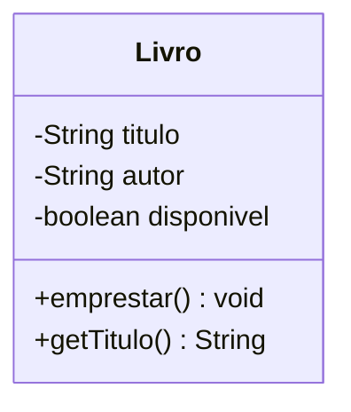
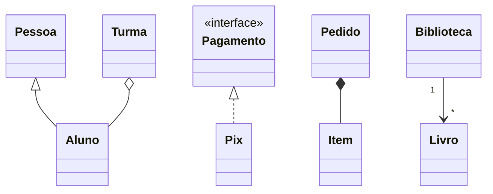
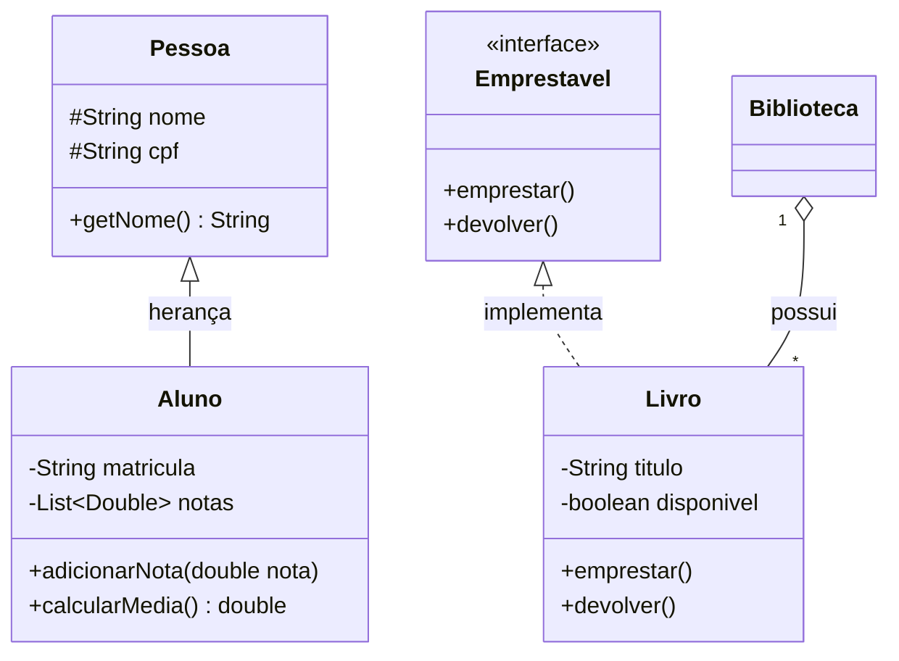
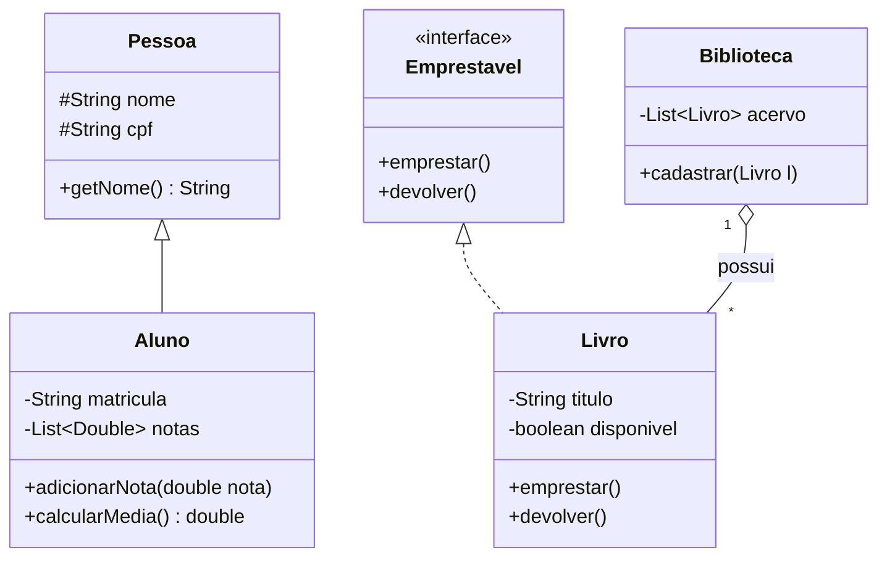

# 📐 Diagrama de Classes em 10 Minutos

Um diagrama de classes é a **planta baixa** do seu sistema: mostra quais classes existem, o que cada uma guarda e como elas se relacionam. Serve para duas coisas no curso:

1. **Pensar antes de digitar** — modelar no papel custa minutos; refatorar código custa horas;
2. **Comunicar** — é o que vai no README dos projetos, para alguém entender seu sistema sem ler 400 linhas.

Usamos uma versão **simplificada da UML**: só o suficiente para conversar.

## A caixa da classe

Três andares: nome, atributos, métodos.



Três andares: o nome da classe, os **atributos** e os **métodos**.

Convenções, e como escrevê-las em Mermaid:

| Símbolo | Significa | Em Mermaid `classDiagram` |
|:---:|---|---|
| `-` | `private` | `-String titulo` |
| `+` | `public` | `+emprestar() void` |
| `#` | `protected` | `#String nome` |
| _itálico_ ou `<<abstract>>` | classe ou método abstrato | `<<abstract>>` dentro da classe |
| `<<interface>>` | interface | `<<interface>>` dentro da classe |
| sublinhado | membro `static` | `+contar()$ int` (o `$` marca `static`) |
| genérico | `List<Double>` | `-List~Double~ notas` (til, não `<>`) |

> 💡 Getters e setters triviais **podem ser omitidos** do diagrama — todo mundo sabe que eles existem. Mostre os métodos que contam a história do sistema (`emprestar`, `calcularSalario`, `salvar`).

## As setas que importam

| Relação | Notação | Lê-se | Em Mermaid |
|---------|---------|-------|------------|
| **Herança** | seta com triângulo vazio ▷ para a superclasse | "é um" | `Pessoa <\|-- Aluno` |
| **Implementação** | seta tracejada com triângulo vazio | "cumpre o contrato de" | `Pagamento <\|.. Pix` |
| **Composição** | losango preenchido ◆ no lado do dono | "é dono de; morre junto" | `Pedido *-- Item` |
| **Agregação** | losango vazio ◇ no lado do dono | "tem, mas não morre junto" | `Turma o-- Aluno` |
| **Associação** | linha simples com multiplicidade | "conhece / usa" | `Biblioteca "1" --> "*" Livro` |

Multiplicidade: `1` (exatamente um), `0..1` (opcional), `*` (muitos). Em Mermaid ela vai entre aspas nas pontas: `Biblioteca "1" --> "*" Livro`.

Renderizado, o vocabulário inteiro fica assim:



## Escrevendo no README com Mermaid

O GitHub renderiza Mermaid direto no Markdown — é o formato pedido nos projetos. Basta um bloco de código com a linguagem `mermaid`:

````markdown

````

Que o GitHub renderiza assim:



Setas em Mermaid: `<|--` herança · `<|..` implementação · `*--` composição · `o--` agregação · `-->` associação. Generics vão entre `~til~`: `List~Livro~`.

## Como modelar em 4 perguntas

Diante de um enunciado ("um sistema para a locadora controlar filmes e clientes..."):

1. **Quais substantivos importantes aparecem?** → candidatos a classe (`Filme`, `Cliente`, `Locacao`);
2. **O que cada um precisa saber?** → atributos;
3. **O que cada um sabe fazer?** → métodos (**verbos** do enunciado: alugar, devolver, calcular multa);
4. **Como eles se ligam?** → um cliente tem várias locações; cada locação tem um filme.

> ⚠️ **Armadilha comum:** transformar tudo em atributo de uma classe só (`Locadora` com 20 campos). Se um substantivo tem dados **e** comportamento próprios, ele merece a própria classe.

> ⚠️ **Segunda armadilha:** herdar porque "parece parecido". Só use herança quando a frase **"todo X é um Y"** for verdadeira sempre. `Cliente` não é `Endereco` — ele **tem** um endereço (composição).

---

🏠 [Voltar ao início](../README.md) · 🧯 [Erros comuns](erros-comuns.md)
